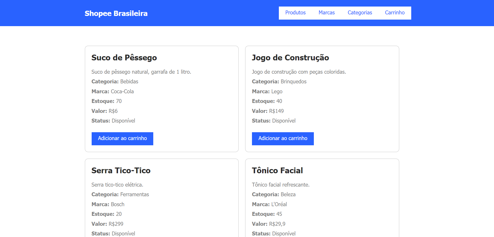
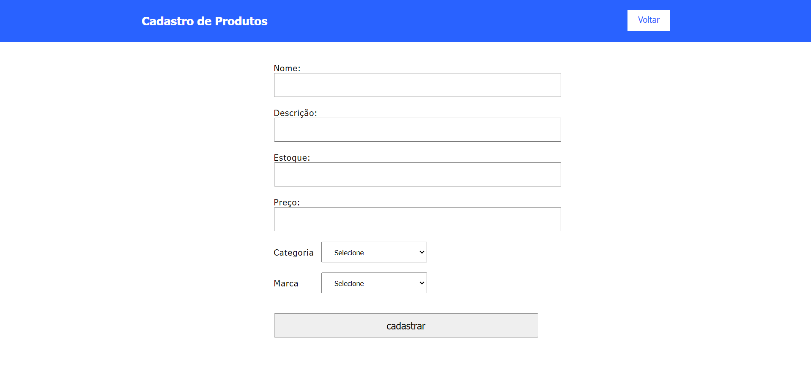
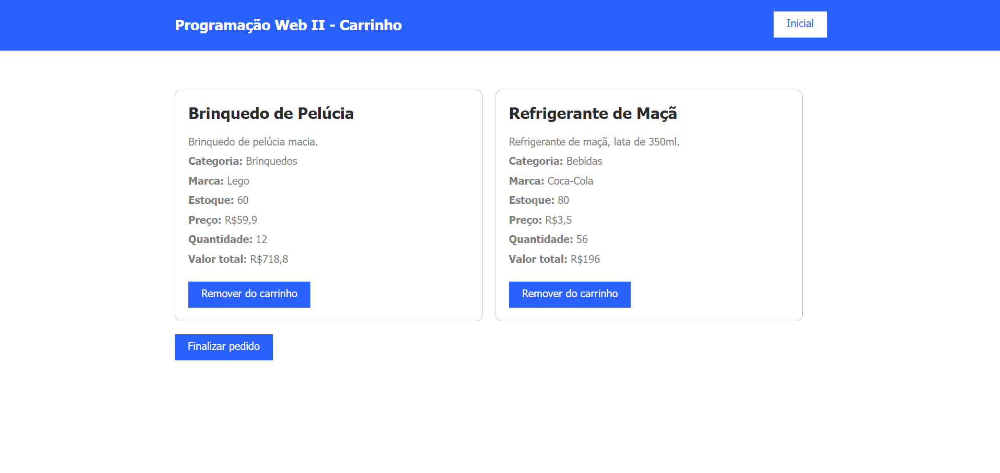

# Sistema de Cadastro de Produtos 📦

**Descrição:**

Este projeto é um sistema de cadastro de produtos, desenvolvido para gerenciar informações de produtos em um banco de dados relacional. O sistema permite a inclusão, visualização e gerenciamento de categorias e marcas, além de armazenar detalhes dos produtos, como nome, descrição, estoque, preço, categoria e marca.

**Tecnologias Utilizadas:**

| Uso | Tecnologia |
| --- | ---------- |
| Banco de Dados | MySQL |
| Linguagem de Programação | PHP 8.2 |
| Linguagem de Formatação | Html 5 |
| Linguagem de Estilização | Css3 |
| Biblioteca | Jquery 2.1.4 |
| Servidor | Apache (XAMPP, Wampp, Etc...) |

#

## **Estrutura do Banco de Dados:**

**Categoria**

``` sql
  CREATE TABLE `categoria` (
    `IDCATEGORIA` int(11) NOT NULL AUTO_INCREMENT,
    `DESCRICAO` varchar(255) NOT NULL,
    PRIMARY KEY (`IDCATEGORIA`)
  ) ENGINE=InnoDB AUTO_INCREMENT=0 DEFAULT CHARSET=latin1 COLLATE=latin1_swedish_ci;
```

**Marca**
``` sql
  CREATE TABLE `marca` (
    `IDMARCA` int(11) NOT NULL AUTO_INCREMENT,
    `DESCRICAO` varchar(255) NOT NULL,
    PRIMARY KEY (`IDMARCA`)
  ) ENGINE=InnoDB AUTO_INCREMENT=0 DEFAULT CHARSET=latin1 COLLATE=latin1_swedish_ci;
```

**Produtos**
``` sql
  CREATE TABLE `produtos` (
    `IDPRODUTO` int(11) NOT NULL AUTO_INCREMENT,
    `NOME` varchar(255) NOT NULL,
    `DESCRICAO` text NOT NULL,
    `ESTOQUE` int(11) NOT NULL,
    `PRECO` decimal(10,2) NOT NULL,
    `IDCATEGORIA` int(11) NOT NULL,
    `IDMARCA` int(11) NOT NULL,
    PRIMARY KEY (`IDPRODUTO`),
    FOREIGN KEY (`IDCATEGORIA`) REFERENCES `categoria`(`IDCATEGORIA`),
    FOREIGN KEY (`IDMARCA`) REFERENCES `marca`(`IDMARCA`)
  ) ENGINE=InnoDB AUTO_INCREMENT=0 DEFAULT CHARSET=latin1 COLLATE=latin1_swedish_ci;
```


### Setup e Instalação

**Clone o Repositório**

``` bash
  git clone https://github.com/vitorgabrieldev/CadEcommerce-Programacao-web-atividade-24-07-2024
  cd CadEcommerce-Programacao-web-atividade-24-07-2024
```


**Configuração do Ambiente**

Configure o servidor MySQL e crie um banco de dados para o projeto com o nome "compra".

``` sql
  CREATA DATABASE `compra`;
```

**Importar Estrutura do Banco de Dados**

Dump do Banco Disponivel em: [Compra-Dump.sql](https://github.com/vitorgabrieldev/CadEcommerce-Programacao-web-atividade-24-07-2024/blob/master/Dump-Projeto-Compra.sql)


**Funcionalidades:**

1. Cadastro e gerenciamento de categorias e marcas.
2. Cadastro de produtos com informações detalhadas.
3. Visualização de produtos com filtros por categoria e marca.


**Contribuição para fins de estudo:**

**Fork o Repositório**

Faça um fork do repositório para seu próprio perfil.

**Crie uma Branch**

Crie uma nova branch para suas modificações:

``` bash
  git checkout -b "minha-nova-feature"
```

**Faça Commit das Suas Mudanças**

Adicione e commit suas mudanças:

``` bash
  git add .
  git commit -m "Descrição das minhas mudanças"
```

**Push para o Repositório Remoto**

Envie suas alterações para o repositório remoto:

``` bash
  git push origin minha-nova-feature
```

**Abra um Pull Request**

Abra um pull request no repositório original para revisar e integrar suas mudanças.

## Visualização do Projeto

Você poderia conferir esse projeto em: [Servidor De Estudo](http://trabalhosprogramacaovitor.free.nf/CadEcommerce/index.php)

## Capturas de tela do projeto

**Tela Inicial da listagem dos produtos**


**Menu de Navegação**


**Menu de Navegação**


**Cadastro de Produtos**


**Tela de Carrinho**


## **Descrição dos Metódos Utilizados:**

| Método                    | Descrição                                                                                       |
| ------------------------- | -------------------------------------------------------------------------------------------------|
| [**include_once()**](https://www.php.net/manual/pt_BR/function.include-once.php)        | Inclui e avalia o arquivo especificado durante a execução do script, garantindo que ele só seja incluído uma vez. |
| [**mysqli_query()**](https://www.php.net/manual/pt_BR/mysqli.query.php)        | Executa uma consulta no banco de dados MySQL.                                                    |
| [**while**](https://www.php.net/manual/pt_BR/control-structures.while.php)                 | Estrutura de repetição que executa um bloco de código enquanto a condição for verdadeira.         |
| [**mysqli_fetch_assoc()**](https://www.php.net/manual/pt_BR/mysqli-result.fetch-assoc.php)  | Busca uma linha de resultado como uma matriz associativa.                                        |
| [**echo**](https://www.php.net/manual/pt_BR/function.echo.php)                  | Exibe uma ou mais strings.                                                                       |
| [**mysqli_affected_rows()**](https://www.php.net/manual/pt_BR/mysqli.affected-rows.php)| Retorna o número de linhas afetadas pela última consulta.                                        |
| [**mysqli_close()**](https://www.php.net/manual/pt_BR/mysqli.close.php)        | Fecha a conexão com o banco de dados MySQL.                                                      |
| [**mysqli_error()**](https://www.php.net/manual/pt_BR/mysqli.error.php)        | Retorna a mensagem de erro da última operação MySQL.                                             |
| [**__construct()**](https://www.php.net/manual/pt_BR/language.oop5.decon.php)         | Método construtor de uma classe, executado automaticamente na criação de um objeto.              |
| [**session_start()**](https://www.php.net/manual/pt_BR/function.session-start.php)       | Inicia uma nova sessão ou resume uma sessão existente.                                           |
| [**$mysqli->query**](https://www.php.net/manual/pt_BR/mysqli.query.php)        | Método orientado a objetos para executar uma consulta no banco de dados MySQL.                   |
| [**mysqli_fetch_object()**](https://www.php.net/manual/pt_BR/mysqli-result.fetch-object.php) | Busca uma linha de resultado como um objeto.                                                     |
| [**array()**](https://www.php.net/manual/pt_BR/function.array.php)               | Cria um array.                                                                                   |
| [**$_SESSION['']**](https://www.php.net/manual/pt_BR/reserved.variables.session.php)         | Superglobal que armazena e acessa variáveis de sessão.                                           |
| [**exit;**](https://www.php.net/manual/pt_BR/function.exit.php)                 | Termina a execução do script.                                                                    |
| [**header('Location:')**](https://www.php.net/manual/pt_BR/function.header.php)   | Envia um cabeçalho HTTP de redirecionamento para o navegador.                                    |
| [**max()**](https://www.php.net/manual/pt_BR/function.max.php)                 | Retorna o valor máximo de um array ou de uma lista de argumentos.                                |
| [**array_keys()**](https://www.php.net/manual/pt_BR/function.array-keys.php)          | Retorna todas as chaves de um array.                                                             |
| [**str_replace()**](https://www.php.net/manual/pt_BR/function.str-replace.php)         | Substitui todas as ocorrências de uma string por outra.                                          |
| [**unset()**](https://www.php.net/manual/pt_BR/function.unset.php)               | Destrói a variável especificada, liberando qualquer recurso associado.                           |
| [**new Carrinho()**](https://www.php.net/manual/pt_BR/language.oop5.basic.php)        | Cria uma nova instância da classe `Carrinho`.                                                    |
| [**mysqli_connect()**](https://www.php.net/manual/pt_BR/mysqli.connect.php)      | Abre uma nova conexão com um servidor MySQL.                                                     |
| [**$mysqli->connect_error**](https://www.php.net/manual/pt_BR/mysqli.connect-error.php)| Propriedade que contém a mensagem de erro da última tentativa de conexão.                        |
| [**$mysqli->set_charset('utf8')**](https://www.php.net/manual/pt_BR/mysqli.set-charset.php) | Define o conjunto de caracteres da conexão MySQL para UTF-8.                                     |
| [**die()**](https://www.php.net/manual/pt_BR/function.die.php)                 | Termina a execução do script e opcionalmente imprime uma mensagem.                               |